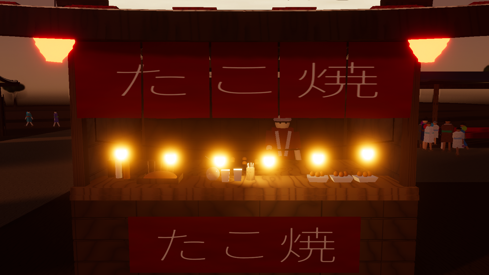
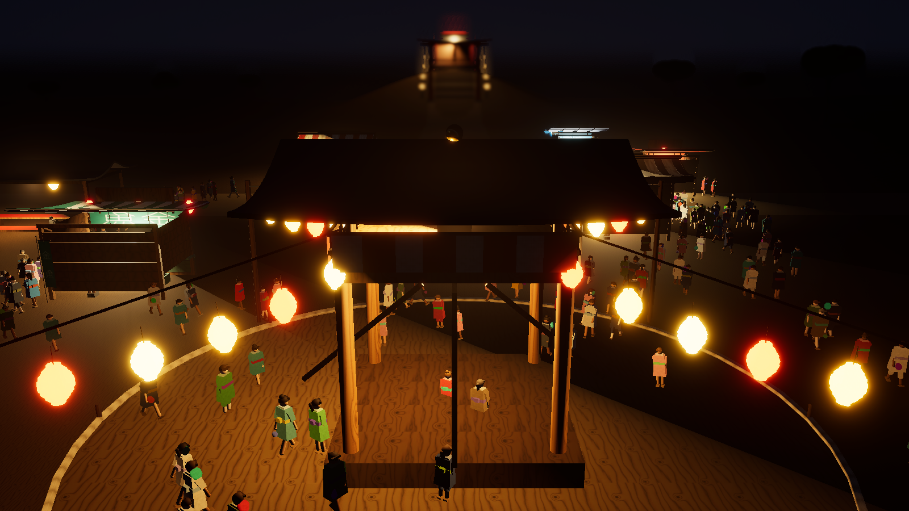

# MATSURI.exe

> コードを書いて、自分だけの夏祭りを作ろう。

Unity 6 (HDRP) の3D夏祭り経営シミュレーション。
プレイヤーは専用言語 **Matsuri Script** で屋台・装飾・イベントを記述し、
RUN すると 3D 空間に祭りが生成される。NPC が来場し、並び、買い、
22:00 に売上が集計される。




---

## 動かす

Unity **6000.4.8f1** で開く。初回のみ：

1. メニュー **`Matsuri` → `3. Build All (Data + Scene)`**
   （ScriptableObject 46件と `Assets/Scenes/Festival.unity` を生成する）
2. `Assets/Scenes/Festival.unity` を開く
3. Play

シーンに置いてあるのは `MatsuriBootstrap` ひとつだけで、
地面・照明・カメラ・マネージャ・UI はすべて実行時にコードが組み立てる（仕様書 §55）。

## 最初に書くコード

```
屋台 "たこ焼き" {
    場所 5, 10
    値段 500
}
```

`▶ RUN`（または `Cmd/Ctrl + Enter`）で屋台が建つ。
`祭りを開催` で 17:00 から祭りが始まり、**実時間2分**で 22:00 を迎える。

## 書けること

| 命令 | 例 |
| --- | --- |
| 屋台 | `屋台 "かき氷" { 場所 10, 15  値段 400 }` |
| 装飾 | `装飾 "提灯" { 場所 3, 4 }` |
| 設備 | `設備 "ベンチ" { 場所 8, 2 }` |
| 居場所 | `設備 "盆踊り場" { 場所 0, -12 }` / `"休憩所"` / `"神社"` / `"手水舎"` |
| イベント | `花火 "大玉"` / `盆踊り` / `太鼓` |
| 時間 | `時間 20:00 { 花火 "大玉" }` |
| 条件 | `もし 来場者数 > 500 { 屋台 "焼きそば" { 場所 20, 10 } }` |
| 行列条件 | `もし たこ焼き.待ち人数 > 20 { ... }` |

英語表記（`stall` / `position` / `price` / `if` / `time`）も同じ AST に落ちる。
読める指標は 来場者数 / 現在の来場者 / 売上 / 予算 / 満足度 / 時刻 /
`<屋台>.待ち人数` / `<屋台>.売上` / `<屋台>.軒数`。

サンプルとデモは `Assets/StreamingAssets/MatsuriSamples/` にある（[DEMO.md](DEMO.md) に一覧）。

---

## カメラ操作

トラックパッドとキーボードだけで動かせる（中ボタン・ホイール不要）。

`WASD` 移動 / `Q` `E` 回転 / `R` `F` 俯角 / `Z` `X` 拡大縮小 / `Space` 全体 / `C` カメラ切替
2本指スクロール ↕ 拡大縮小・↔ 回転 / 1本指ドラッグ 移動 / `Option`+ドラッグ 回転

コードを書いている間はキー操作が効かない（文字入力が優先）。会場をクリックすると戻る。
詳細は [DEMO.md](DEMO.md)。

---

## 中身

```
Source (.matsuri)
  → Lexer → Parser → AST → Validator → Interpreter
  → FestivalPlan { 即時コマンド, 開催中ルール }
  → IFestivalCommandSink (= FestivalManager)  ← ここで初めて GameObject に触る
```

言語処理系（`Matsuri.Script`）はゲーム側を一切知らないので、
Unity を起動せずに単体テストできる。

| Assembly | 役割 |
| --- | --- |
| `Matsuri.Script` | 字句・構文・検証・解釈・補完。Unity のゲーム機能に非依存 |
| `Matsuri.Runtime` | ゲーム本体（マネージャ / NPC / 屋台 / アート / UI / 音） |
| `Matsuri.Editor` | データとシーンの自動生成ツール |
| `Matsuri.Tests.*` | EditMode 229ケース / PlayMode 統合テスト26ケース |

詳細は [IMPLEMENTATION_PLAN.md](IMPLEMENTATION_PLAN.md)、
3Dアセットの差し替え手順は [ART_PIPELINE.md](ART_PIPELINE.md)。

## テスト

```bash
Unity -batchmode -nographics -projectPath . -runTests -testPlatform EditMode -testResults results.xml
```

PlayMode 側は仕様書 §73 の MVP 完成条件
（コードを書く → 建つ → 開催 → NPC が来る → 並ぶ → 買う → 売上 → 結果）
をそのまま一本のテストにしてある。

---

## ライセンス

同梱の Noto Sans JP (`Assets/UI/Fonts/`) は SIL Open Font License 1.1。
